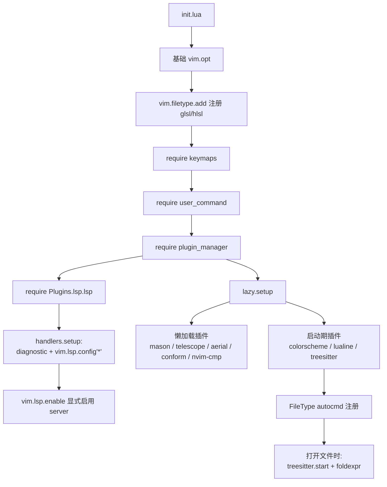

## Context

本设计将 Neovim 配置从「treesitter master 时代 + 一批废弃 API」迁移到「treesitter main 分支 + Neovim 0.11 原生 LSP + 懒加载」的状态。

设计遵循三条原则：

1. **先恢复功能，再做优化** —— treesitter 失效是唯一影响日常使用的问题，优先级最高
2. **显式行为契约** —— 除已确认的 Copilot 移除、shader filetype、全局边框与命令行补全变化外，所有按键与命令的语义保持不变
3. **失败可见但不阻塞** —— 外部依赖（tree-sitter CLI、clang-format）缺失时给出可读提示，不抛堆栈、不阻塞启动

### 已验证的技术前提

| 结论 | 验证方式 |
| --- | --- |
| `install()` 幂等，已安装则跳过 | `install.lua:477` `if not force and vim.list_contains(config.get_installed(), lang)` |
| `install()` 是 async，不阻塞 | `M.install = a.async(function(languages, options)` |
| `InstallOptions` 支持 `force` / `generate` / `max_jobs` / `summary` | `install.lua:500-504` |
| hlsl parser 存在，依赖 cpp；glsl 依赖 c | `parsers.lua` 中 `requires = { 'cpp' }` / `{ 'c' }` |
| `requires` 会被自动加入安装列表 | `config.norm_languages` 内 `parsers[lang].requires` 展开 |
| `vim.lsp.enable` / `vim.o.winborder` / `vim.treesitter.foldexpr` 均可用 | `nvim --clean` 实测 |
| main 分支用 `tree-sitter` CLI 编译，不再用 zig | `install.lua:204,307` 调用 `tree-sitter generate/build` |
| mason 现有包：lua-language-server、pyright、rust-analyzer | `nvim-data/mason/packages` 目录；Mason 的 `rust-analyzer.cmd --version` 实测可用 |

## Goals / Non-Goals

**Goals:**

- 恢复 nvim-treesitter main 分支下的 parser 安装、高亮、折叠与相关插件集成。
- 迁移到 Neovim 0.11 原生 API，并保持现有按键、命令与自动 LSP 行为。
- 引入统一的显式格式化入口，清理死依赖、Copilot 集成与非预期全局写入。
- 通过按需加载和可重复测量降低启动耗时，并建立自动化回归验证。

**Non-Goals:**

- 不改变现有按键映射语义，除非旧 API 已无法继续提供原行为。
- 不改动 `lsp/lua_ls.lua` 的原生 `lsp/` 目录布局。
- 不引入新的补全引擎、colorscheme 或 lint 插件。
- 不自动安装 `clang-format`、`stylua`、`ruff`、`black` 等系统级 formatter，也不主动删除本机 lazy 插件缓存。
- 不为了达到 200ms 目标而牺牲功能或改动用户自有插件。

---

## Decisions

- 保持 `nvim-treesitter` 在 `main` 分支，并显式声明分支；不回退到已冻结的 `master`。
- parser 安装采用 UI 会话中的异步、幂等安装；headless 验证不触发下载编译。
- 高亮和折叠通过原生 `vim.treesitter` API 在 `FileType` 事件按 buffer/window 挂载。
- LSP 使用 `vim.lsp.config` 与 `vim.lsp.enable` 显式配置；mason 只负责安装和管理，不再隐式控制启用时序。
- lua_ls、pyright、rust_analyzer 的二进制统一由 Mason 管理；启动期前置 Mason bin，系统 PATH/rustup 中的同名程序不作为配置后备。
- 格式化入口统一为显式 `:Format`，由 conform.nvim 优先使用外部 formatter、缺省回落 LSP，且不启用保存时格式化；formatter 缺失时只验证配置与可读提示。
- 完整移除 `copilot.lua`、`copilot-cmp`、`CopilotChat.nvim` 及其补全、命令和验收入口；本机缓存留给用户后续 `:Lazy clean`。
- `lazy-lock.json` 纳入版本控制；OpenSpec 是唯一维护的规格来源，Kiro 原规格只保留迁移审计用途。
- 插件懒加载必须完整保留原按键模式、命令入口及自动 LSP 触发条件。

## Architecture

### 目标文件结构

```
nvim/
├── init.lua                      改：vim.uv、winborder、filetype 规则移交 vim.filetype.add
├── lsp/
│   └── lua_ls.lua                改：清理错乱注释；其余 server 使用 nvim-lspconfig 自带定义
├── lua/
│   ├── keymaps.lua               改：diagnostic.jump
│   ├── user_command.lua          改：SetDiagnosticSeverity 去全局化
│   ├── plugin_manager.lua        改：vim.uv、去 null-ls/Copilot、加 conform、懒加载、去 _G.opts
│   └── Plugins/
│       ├── treesitter.lua        重写：install + FileType autocmd
│       ├── textobjects.lua       新增：从 treesitter.lua 拆出
│       ├── conform.lua           新增
│       ├── nvim-cmp.lua          改：local unpack
│       ├── telescope.lua         不变（仅由 lazy keys 触发）
│       ├── neo-tree.lua          不变
│       └── lsp/
│           ├── lsp.lua           改：显式 vim.lsp.enable，不依赖 mason 自动启用
│           ├── handlers.lua      改：winborder、documentHighlightProvider、autocmd API
│           └── utility.lua       不变
└── README.md                     改：tree-sitter CLI、格式化工具、移除 zig 说明
```

### 加载时序



关键顺序约束：`vim.lsp.config("*", ...)` 必须在 `vim.lsp.enable(...)` 之前执行，否则 `on_attach` 与 `capabilities` 不会应用到已启用的 server。

---

## Components and Interfaces

### 1. treesitter 模块（`Plugins/treesitter.lua`）

**职责**：声明 parser 列表、触发安装、在 FileType 事件启动高亮与折叠。

```lua
local M = {}

-- Parsers to install. Dependencies (c for glsl, cpp for hlsl) are resolved
-- automatically by norm_languages.
M.languages = {
    "c", "cpp", "lua", "rust", "python",
    "vim", "vimdoc", "query",
    "glsl", "hlsl",
    "markdown", "markdown_inline", "json", "bash",
}

function M.setup()
    local ok, ts = pcall(require, "nvim-treesitter")
    if not ok then return end

    ts.setup({ install_dir = vim.fn.stdpath("data") .. "/site" })

    M.install_async()
    M.attach_autocmd()
end
```

**安装策略**

`install()` 幂等且异步，但仍不在启动路径上直接调用 —— 首次运行会拉取十几个 grammar 仓库，即使异步也会争抢 IO。设计为：

```lua
function M.install_async()
    if #vim.api.nvim_list_uis() == 0 then
        return
    end

    if vim.fn.executable("tree-sitter") == 0 then
        vim.schedule(function()
            vim.notify(
                "tree-sitter CLI not found; parsers cannot be installed.\n"
                    .. "Install with: npm install -g tree-sitter-cli",
                vim.log.levels.WARN
            )
        end)
        return
    end

    local config = require("nvim-treesitter.config")
    local missing = vim.tbl_filter(function(lang)
        return not vim.list_contains(config.get_installed("parsers"), lang)
    end, M.languages)

    if #missing == 0 then return end

    vim.schedule(function()
        require("nvim-treesitter").install(missing, { summary = true })
    end)
end
```

设计要点：
- CLI 缺失时只 notify，不报错、不阻塞（R1.5）
- headless 会话直接返回，不产生网络下载或 parser 编译副作用（R1.9）
- 自己先过滤 missing，避免无谓地进入 async 调度（R1.6）
- `vim.schedule` 把安装推到启动之后
- `summary = true` 让用户看到进度而非静默

**高亮与折叠挂载**

```lua
-- Filetypes that map directly to an available parser.
M.filetypes = {
    "c", "cpp", "lua", "rust", "python",
    "vim", "help", "query",
    "glsl", "hlsl",
    "markdown", "json", "sh", "bash",
}

function M.attach_autocmd()
    vim.api.nvim_create_autocmd("FileType", {
        group = vim.api.nvim_create_augroup("sal_treesitter", { clear = true }),
        pattern = M.filetypes,
        callback = function(args)
            local lang = vim.treesitter.language.get_lang(args.match)
            if not lang or not pcall(vim.treesitter.language.add, lang) then
                return
            end

            vim.treesitter.start(args.buf, lang)
            vim.wo[0][0].foldmethod = "expr"
            vim.wo[0][0].foldexpr = "v:lua.vim.treesitter.foldexpr()"
        end,
    })
end
```

设计要点：
- `pcall(vim.treesitter.language.add, lang)` 是 parser 可用性探测，失败则静默 return，回落内置 syntax（R2.3）
- `vim.wo[0][0]` 而非 `vim.o`，因为 `foldexpr` 是窗口局部选项（R3.3）；`[0][0]` 形式避免污染全局默认值
- 不设 `foldenable`，`init.lua` 里的 `foldenable = false` 继续生效（R3.4）
- 全局 `foldmethod`/`foldexpr` 从旧配置中删除

**vim-matchup 集成**

master 时代通过 treesitter 的 `matchup = { enable = true }` 启用。main 分支没有这个入口，改用 vim-matchup 自己的选项：

```lua
vim.g.matchup_matchparen_offscreen = { method = "popup" }
vim.g.matchup_treesitter_enabled = 1
vim.g.matchup_treesitter_disabled = { "c", "ruby" }
```

放在 vim-matchup 插件声明的 `init`（而非 `config`），保证在插件加载前生效。该单一声明必须使用 `lazy = false` 在启动期加载：命令行文件的首次 `FileType` 早于 `VimEnter`，若用 `event = "VimEnter"`，插件虽会加载并注册 `%` 映射，却会漏掉首个 buffer 的 delimiter engine 初始化。

### 2. textobjects 模块（`Plugins/textobjects.lua`）

从 treesitter.lua 拆出，消除 setup 里的死 `keymaps` 字段（R4.2）与 `as` 的重复定义（R4.3）。

```lua
local M = {}

-- Single source of truth for textobject mappings.
M.mappings = {
    { key = "af", query = "@function.outer", group = "textobjects" },
    { key = "if", query = "@function.inner", group = "textobjects" },
    { key = "ac", query = "@class.outer",    group = "textobjects" },
    { key = "ic", query = "@class.inner",    group = "textobjects" },
    { key = "as", query = "@local.scope",    group = "locals" },
}

function M.setup()
    local ok, textobjects = pcall(require, "nvim-treesitter-textobjects")
    if not ok then return end

    textobjects.setup({
        select = {
            lookahead = true,
            include_surrounding_whitespace = false,
        },
    })

    for _, m in ipairs(M.mappings) do
        vim.keymap.set({ "x", "o" }, m.key, function()
            require("nvim-treesitter-textobjects.select")
                .select_textobject(m.query, m.group)
        end, { remap = false, silent = true, desc = "Select " .. m.query })
    end
end
```

`as` 统一为 `@local.scope` + `locals`（与原手写映射一致，因为那份才是实际生效的）。

### 3. LSP 模块

**`Plugins/lsp/lsp.lua`** —— 关键变更是**不再依赖 mason-lspconfig 的 `automatic_enable`**。

理由：mason 要改成 `cmd` 懒加载（R10.2），而 `automatic_enable` 是当前 LSP 自动启动的唯一来源（前面实测 `vim.lsp._enabled_configs` 有三个 server 全靠它）。懒加载后 mason 在启动时不加载，server 就不会被启用，直接违反 R10.7。

解法是把「启用」这件事从 mason 手里收回，由配置显式声明：

```lua
local M = {}

M.servers = { "lua_ls", "pyright", "rust_analyzer" }

function M.setup()
    -- Must run before vim.lsp.enable so that on_attach/capabilities apply.
    require("Plugins.lsp.handlers").setup()

    -- Server definitions come from the native lsp/ directory.
    vim.lsp.enable(M.servers)
end

return M
```

mason 的角色退化为「按需安装 server 二进制」，通过 `cmd = { "Mason", "MasonInstall", "MasonUninstall", "MasonUninstallAll", "MasonUpdate", "MasonLog" }` 懒加载。`ensure_installed` 交给 mason-lspconfig，但它只在 mason 被加载时才生效 —— 这是有意的权衡：

- 收益：启动省下约 25ms
- 代价：新机器首次使用需手动 `:Mason` 装 server
- 记录在 README（R11.5）

`rust_analyzer` 与 lua_ls、pyright 一样统一由 Mason 管理。当前机器即使同时存在 rustup 与 Mason 版本，也通过在 `vim.lsp.enable` 前将 `stdpath("data").."/mason/bin"` 前置到 PATH 来固定来源；不得把系统 PATH/rustup 作为隐式后备。新机器首次使用前需通过 `:Mason` 或 `:MasonInstall rust-analyzer` 安装。此取舍记录在 ADR 0002。

**`Plugins/lsp/handlers.lua`** —— 五处 API 迁移。

| 项 | 现状 | 改为 |
| --- | --- | --- |
| 浮窗边框 | `vim.lsp.with()` 覆盖两个 handler | `vim.o.winborder = "rounded"` |
| document highlight 能力 | `server_capabilities.documentHighlight` | `server_capabilities.documentHighlightProvider` |
| autocmd 创建 | `nvim_exec` + vimscript augroup | `nvim_create_autocmd` |
| `:Format` | `vim.lsp.buf.formatting()` | 移交 conform（见下） |
| tsserver 判断 | `client.name == "tsserver"` | `"ts_ls"` |
| float source | `source = "always"` | `source = true` |

```lua
local function lsp_highlight_document(client, bufnr)
    if not client.server_capabilities.documentHighlightProvider then
        return
    end

    local group = vim.api.nvim_create_augroup(
        "sal_lsp_document_highlight_" .. bufnr, { clear = true })

    vim.api.nvim_create_autocmd("CursorHold", {
        group = group,
        buffer = bufnr,
        callback = vim.lsp.buf.document_highlight,
    })
    vim.api.nvim_create_autocmd("CursorMoved", {
        group = group,
        buffer = bufnr,
        callback = vim.lsp.buf.clear_references,
    })
end
```

augroup 按 bufnr 命名，替代原 vimscript 里 `autocmd! * <buffer>` 的清理语义。

`winborder` 是全局选项，会同时影响 hover、signature help、diagnostic float 与其他未显式指定边框的浮窗。最终人工验收发现，直接从自动化环境用 `Start-Process nvim` 启动时会进入独立 `conhost.exe`，rounded 圆角字符出现错位；用户同时观察到其他启动有时正常。进程树表明用户日常环境是使用 grapheme 文本测量的 Windows Terminal，因此保留用户偏好的 `rounded`，并要求在日常 Windows Terminal profile 中进行最终视觉验收。该行为变化会在实施时告知。

### 4. conform 模块（`Plugins/conform.lua`）

```lua
local M = {}

M.formatters_by_ft = {
    c = { "clang-format" },
    cpp = { "clang-format" },
    lua = { "stylua" },
    python = { "ruff_format", "black", stop_after_first = true },
    -- rust: handled by rust_analyzer's built-in rustfmt via lsp_format
}

function M.setup()
    require("conform").setup({
        formatters_by_ft = M.formatters_by_ft,
        -- Fall back to LSP when no external formatter is configured.
        default_format_opts = { lsp_format = "fallback" },
        format_on_save = false,
        notify_on_error = true,
        notify_no_formatters = true,
    })
end

return M
```

`:Format` 命令重新定义为全局命令（不再在 `on_attach` 里重复创建）：

```lua
vim.api.nvim_create_user_command("Format", function(args)
    local range
    if args.count ~= -1 then
        range = {
            start = { args.line1, 0 },
            ["end"] = { args.line2, math.huge },
        }
    end
    require("conform").format({ async = true, lsp_format = "fallback", range = range })
end, { range = true, desc = "Format buffer or range" })
```

设计要点：
- `lsp_format = "fallback"` 满足 R6.6：有外部工具用工具，没有则走 LSP。rust 因此自动走 rust_analyzer 的 rustfmt（R6.5）
- `format_on_save = false` 保持显式调用（R6.8）
- `range = true` 支持可视区域格式化，比原 `:Format` 更强
- conform 通过 `cmd = "ConformInfo"` + 上述命令懒加载（R6.9）
- `notify_on_error` / `notify_no_formatters` 显式为 true，工具缺失时给出可读提示且可用 `:ConformInfo` 诊断（R6.7、R6.12）

python 用 `ruff_format` 优先、`black` 兜底，`stop_after_first` 避免两个都跑。formatter 是与 Neovim 独立的系统命令，本任务不自动安装；缺失时成功格式化路径记为“未验证”，但配置与错误提示仍是硬门禁。

### 5. 非预期全局写入清理

| 位置 | 问题 | 解法 |
| --- | --- | --- |
| `plugin_manager.lua` | `opts = { rocks = ... }` 漏 local | 直接内联进 `lazy.setup(plugins, { rocks = { enabled = false } })` |
| `nvim-cmp.lua` | `unpack = unpack or table.unpack` | `local unpack = unpack or table.unpack` 提到文件顶部 |
| `user_command.lua` | `function SetDiagnosticSeverity` | 改 `local function`，命令注册处引用不变 |

`SetDiagnosticSeverity` 去全局化后行为需保持：它读写 `_G.sal_diagnostic_severity`，并调用 `vim.diagnostic.config` 更新 underline severity。该名称是唯一允许的项目自定义 `_G` 状态；“消除全局变量”统一表述为“消除非预期全局写入”，定义见仓库根目录 `CONTEXT.md`。

### 6. filetype 规则迁移

`init.lua` 现用两条 `vim.cmd('au BufNewFile,BufRead ...')`。改为 `vim.filetype.add`，更快且可被 treesitter 的 FileType autocmd 正确捕获：

```lua
vim.filetype.add({
    extension = {
        frag = "glsl", vert = "glsl", fp = "glsl", vp = "glsl",
        glsl = "glsl", fsh = "glsl", vsh = "glsl",
        hlsl = "hlsl", fx = "hlsl", fxh = "hlsl", psh = "hlsl", shader = "hlsl",
    },
})
```

原配置里 `vsh` 同时出现在 glsl 和 fx 两条规则中（后者覆盖前者）。已确认将 `.vsh` 固定为 `glsl`、`.shader` 固定为 `hlsl`，接受覆盖 Neovim 对 V 语言和 Godot shader 的内置判断；代码注释与自动断言必须锁定这一有意行为。

---

## Startup Performance Strategy

本次验证脚本测得的可执行基线为 367.068ms；早期调查的 327ms 仅作为历史参考。200ms 是首屏可交互时间的尽力目标，热点历史记录为 `plugin_manager` self 89ms、`Plugins.lsp.lsp` self 25ms。

| 插件 | 当前 | 改为 | 依据 |
| --- | --- | --- | --- |
| mason | 启动加载 | 六个实际命令触发：`Mason` / `MasonInstall` / `MasonUninstall` / `MasonUninstallAll` / `MasonUpdate` / `MasonLog` | LSP 启用已收回自管 |
| mason-lspconfig | 启动加载 | mason 的 dependency | 同上 |
| null-ls | 启动加载 | **删除** | 从未引用 |
| telescope | 启动加载 | `keys = { "<C-p>", "<C-f>", "<C-b>", "<F3>" }` | 配置里已有这些映射 |
| aerial | 启动加载 | `keys = { "<F4>", "<S-F4>" }` | 同上 |
| copilot.lua / copilot-cmp / CopilotChat | 启动加载 | **全部删除** | 用户确认不再需要 Copilot 能力 |
| conform | 新增 | `cmd = "ConformInfo"` + Format 命令内 require | 按需 |
| tabular / vim-exchange / vim-abolish / vim-mark | 启动加载 | `event = "VeryLazy"` | 非启动必需 |
| nvim-cmp 及 sources | 启动加载 | `event = { "InsertEnter", "CmdlineEnter" }` | 插入与命令行补全均需触发 |
| treesitter | 启动加载 | 保持 | 需注册 FileType autocmd |
| colorscheme / lualine | 启动加载 | 保持 | 视觉必需 |

telescope 与 aerial 用 `keys` 懒加载时，按键需在 lazy 声明里定义，而各自的 `config` 里还会再定义一次同名映射 —— lazy 的 `keys` 是占位映射，插件加载后被 config 里的真实映射覆盖，这是 lazy 的标准模式，行为一致（R10.3、R10.4、R10.6）。

**风险**：`keys` 占位映射对 `<C-p>` 这类高频键有首次触发延迟（需等插件加载）。可接受，因为只有首次。

**测量方法**：`nvim --startuptime` 连续 5 次，首轮预热后对其余 4 次取中位数（R10.8）。主指标是首屏可交互时间，同时报告 VeryLazy 完成后的补充耗时或加载清单，禁止把工作简单后移就算作优化；若达不到 200ms，记录瓶颈（R10.9、R10.10）。

---

## Risks / Trade-offs

- [`nvim-treesitter/main` 尚未稳定] → 由 `lazy-lock.json` 固定版本，`:Lazy update` 后优先检查上游 breaking change。
- [tree-sitter CLI 或 formatter 缺失] → 使用可读通知和 README 安装说明，禁止阻塞启动或抛出堆栈；formatter 不自动安装，成功路径可记未验证。
- [`vim.o.winborder` 影响所有未显式设置边框的浮窗] → 自动化环境直接启动的独立 conhost 会错误呈现 rounded；最终视觉检查必须从用户日常 Windows Terminal profile 启动，不再用 `Start-Process nvim` 创建独立控制台，并逐个回归全部浮窗。
- [懒加载可能丢失 visual/operator 模式映射或破坏自动 LSP] → 在 lazy 声明中保留完整 `mode`，并对 Lua/Python/Rust 文件逐一验证 client 挂载。
- [200ms 目标受用户自有插件和机器抖动影响] → 多次测量取稳定值；未达标时记录瓶颈，不以功能退化换取数字。
- [shader 扩展名覆盖 Neovim 内置 filetype] → 在代码中明确注释并通过 filetype 断言锁定有意行为。

## Error Handling

| 场景 | 处理 |
| --- | --- |
| tree-sitter CLI 缺失 | `vim.notify` WARN + 安装指引，跳过安装，不阻塞 |
| parser 未安装但打开对应文件 | `pcall(language.add)` 失败则 return，回落内置 syntax |
| parser 编译失败 | `install()` 内部 logger 记录，`summary = true` 显示 |
| clang-format / stylua 缺失 | conform 报 "no formatter available"；`:ConformInfo` 诊断 |
| 某 LSP server 二进制缺失 | `vim.lsp.enable` 不报错，server 静默不启动；`:checkhealth vim.lsp` 可见 |
| 插件 require 失败 | 各模块 setup 入口统一 `pcall` |

所有对外部可执行文件的依赖都走 `vim.fn.executable()` 预检而非 pcall 捕获异常，这样能给出可操作的提示而非堆栈。

---

## Testing Strategy

配置类项目没有单元测试框架，验证依赖可执行的断言脚本。

### 验证脚本设计

在 OpenSpec change 目录下建 `verify.lua`，用 `nvim --headless -l` 执行，写结果到文件后退出。

**关键约束**（来自本次调查中的实际踩坑）：

- **不要在 headless 下等待 LSP 挂载**。`vim.wait` 等 client 时，lua_ls 在 headless 会以 exit code 1 退出，错误消息触发无人应答的 hit-enter 提示，进程永久挂起。LSP 相关断言改为检查配置状态（`vim.lsp.config`、`vim.lsp.is_enabled`）而非运行时 client。
- **命令要带 timeout**，避免挂起时无限等待。
- **临时文件始终清理**。`verify.lua` 使用受保护主流程保证成功、断言失败和异常均进入清理；生成器重建目标 suite 目录以删除陈旧夹具（R11.4、R11.9）。

### 断言矩阵

| 需求 | 断言 |
| --- | --- |
| R1.2 | `vim.list_contains(vim.opt.rtp:get(), stdpath('data')..'/site')` |
| R1.4 | `get_installed('parsers')` 包含目标列表 |
| R1.8 | `.hlsl` / `.fx` 的 filetype 均为 `hlsl`，`.vsh` 为 `glsl`，`.shader` 为 `hlsl` |
| R2.2 | 打开 `.cpp` 后 `vim.treesitter.highlighter.active[buf] ~= nil` |
| R3.1 | `pcall(vim.fn.eval, ...)` 不再出现 E117；`vim.wo.foldexpr` 含 `vim.treesitter.foldexpr` |
| R4.1 | grep treesitter.lua 无 `ensure_installed`/`highlight`/`matchup` 等字段 |
| R5.x | grep 全仓库无 `buf.formatting`/`goto_prev`/`goto_next`/`vim.loop`/`nvim_exec(`/`documentHighlight\b`/`tsserver` |
| R6.1/R6.12 | `:Format` 存在、conform 可 require，通知开关显式为 true |
| R7.2/R7.4-R7.5 | grep 无 `null-ls`、`copilot`、`CopilotChat`、`CC` 残留；lockfile 无对应项 |
| R8.1-R8.5 | `_G.opts == nil`、nvim-cmp 无非局部 `unpack`、`_G.SetDiagnosticSeverity == nil`，并保留 `_G.sal_diagnostic_severity` 语义 |
| R10.1/R10.10 | 报告首屏中位数相对 367.068ms 基线、327ms 历史参考及 200ms 目标的差异，并报告 VeryLazy 补充工作 |
| R11.3 | `checkhealth` 稳定签名相对基线不新增 ERROR/deprecated；既有无关 WARNING 单独报告 |

### 人工验证夹具

`generate_manual_tests.ps1` 只为能通过启动 Neovim、打开代表性文件并进行编辑器内操作直接观察的行为生成夹具。纯规格、Git 基线、验证脚本、静态断言、内部状态、性能报告或文档任务由自动检查负责，不生成要求用户审阅内部实现或命令输出的人工验收包。脚本支持按行为套件或 `all` 批量生成，并且重复执行结果一致。

- `treesitter`：生成包含嵌套函数、类、括号和 textobject 查询目标的 C++/Lua 文件，以及 `.hlsl`、`.fx`、`.vert`、Markdown 文件，用于观察 filetype、高亮、折叠、matchup、context 和 textobjects。
- `tooling`：生成故意排版混乱的 C++/Lua/Python 文件与最小 Rust project，用于验证 `:Format`、范围格式化、formatter 缺失提示和 lua_ls/pyright/rust_analyzer 挂载。
- `lazy-loading`：提供 normal/visual/operator 模式按键与命令清单，用同一组文件验证 Telescope、aerial、hop、nvim-cmp 和浮窗边框；不再包含 Copilot。
- `TESTING.md`：逐项写出打开哪个文件、执行哪个按键或命令、预期看到什么，并留出通过/失败/未验证的记录位置。

自动化断言通过后，只有涉及 Neovim 可观察行为的任务才进入人工验证。相关任务可以复用同一行为套件；存在未完成依赖时暂不生成或执行验收。只有用户明确确认可观察行为通过后，相关行为任务或 checkpoint 才能完成。非可观察任务在自动检查通过后直接完成。

夹具及临时 `TESTING.md` 位于可清理/忽略目录；用户在协作对话中反馈通过、失败项与备注后，由实施者按 `verification/TEMPLATE.md` 将环境、操作项、通过项、失败项、备注与日期固化到 `verification/<任务编号>.md` 并纳入版本控制，不要求用户手工编辑结果文件，也不得由实施者推测用户确认。非可观察任务不创建空结果文件。自动化、启动、目标功能和既有行为回归均为硬门禁；只有 formatter 未安装或外部服务不可用等环境限制可记“未验证”，任何真实失败都阻塞下一阶段。

### 分阶段验证

每个顶层实施任务完成代码与自动化检查后，先判断是否存在能通过打开相关文件直接确认的 Neovim 行为；存在时生成对应行为套件，不存在时不增加人工步骤。每个阶段结束再跑一次「启动无错误」基线检查：

```
nvim --headless -c "messages" -c "qa!" 2>&1
```

输出中不应出现 `E\d+`、`Error`、`deprecated`。

---

## Migration Plan

1. 修订 OpenSpec/术语/ADR，加固验证脚本，记录 367.068ms 可执行基线与 health 稳定签名，并建立迁移基线提交。
2. 恢复 treesitter 与 shader filetype，再完成第一轮 checkpoint。
3. 迁移 Neovim 0.11 API，引入 conform，并移除 null-ls 与全部 Copilot 集成，再完成第二轮 checkpoint。
4. 清理全局变量和 LSP 结构，最后实施插件懒加载与启动性能优化。
5. 更新 README，执行全量自动化、health、视觉和按键回归检查。

### Rollback Plan

配置在 git 仓库中。当前 `.kiro/`、`docs/`、`openspec/` 尚未跟踪，且 `.gitignore` 已调整为纳入 `lazy-lock.json`、忽略 `ultisnips/**`；这些迁移资产与策略必须先形成基线提交，之后才可宣称阶段可回滚。

- 每个阶段单独提交，便于 `git revert` 单点回退
- 不使用 `git commit --amend`、`reset --hard` 等破坏性操作
- 阶段边界：① treesitter 修复 ② API 迁移 ③ conform + null-ls ④ 清理 ⑤ 懒加载 ⑥ 文档
- `lazy-lock.json` 纳入版本控制并随插件增删/升级一并提交

前三个阶段任一失败都可独立回退而不影响其他阶段，因为它们改动的文件几乎不重叠。阶段 ⑤（懒加载）改动面最大且风险最高，放在最后。

## Resolved Questions

- OpenSpec 是唯一维护的规格来源；Kiro 原规格只读保留并指向本 change。
- 人工夹具只覆盖 Neovim 可观察行为且不提交，确认结果摘要纳入版本控制。
- formatter 不自动安装；缺失导致的成功路径可记“未验证”。
- Copilot 配置与插件声明完整移除，本机缓存不主动清理。

实施过程中若 parser 安装、浮窗边框或插件懒加载出现与已验证前提不一致的行为，应暂停对应阶段并更新本设计与 capability spec。
